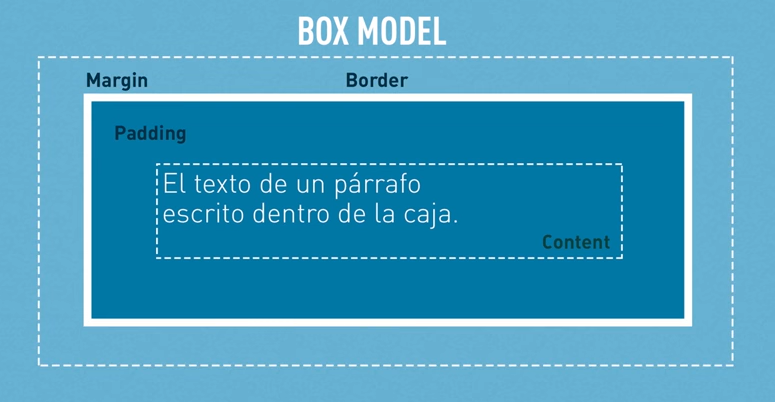

## Content

1. Box Model
2. Display
3. Background
4. Measurement units

# 1. Box Model

# 2. Display

Display have 3 more important options:

`inline` => This property is used when we don't want that the element behavior like a box. I want the element flout with the text.

`inline-block` => This property indicate that the element is a box but is also align to the other elements.

`block` => It indicate that the behavior will be like a box, it means like the box model, will have a box with padding, border and margin.

[Examples here...](https://codepen.io/LeslieMeneses/pen/dyyeejm)

# 3. Background

The property background have many options like: image, color, position, repeat and attachment.

`background` With it we can use all the properties that we want.

`background-color` Is the color that we want to use for the background.

`background-image` If we want to use an image in the background we should use it.

`background-repeat` When we want to say that we don't want to repeat the image in the background.

`background-attachment` We use it to give some behaviors to the background image. We can use `scroll`, `fixed`.

[Examples here...](https://codepen.io/LeslieMeneses/pen/dyyeKJL)

# Measurement units
We can use measurement relatives and absolute.

`px` is absolute size that we use and will look the same in phone, tablets, desktops etc.

`em` This measurement is relative to the font-size inherited.

`rem` This one is relative to the html font-size.

`%` Is relative to the space available of it content inherited.
