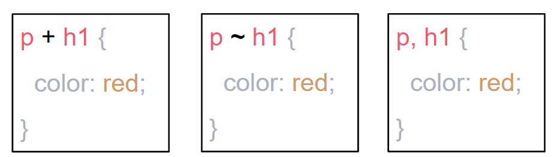

# SELECTORES

## Que etiqueta tendrá el color rojo?



### 1. `(p + h1)` => La etiqueta `p` tendrá el color rojo.
### 2. `(p ~ h1)` => La etiqueta h1 tendrá el color rojo.
### 3. `(p, h1)` => Los dos tendrán el color rojo.
### 4. `(p > h1)` => La etiqueta h1 tendrá el color rojo.
### 5. `(p h1)` => La etiqueta h1 va a tener el color rojo

## Definicion:
`(A + B)` => Selecciona hermanos adyacentes.
> Ejemplo: `h2 + p` se aplicará a todos los elementos `<p>` que siguen inmediatamente después del elemento `<h2>`.

`(A ~ B)` => Selecciona hermanos que esten dentro del mismo padre.
> Ejemplo: `p ~ span` se aplicará a todos los elementos `<span>` que sigan luego de un elemento `<p>` y que tengan el mismo padre.

`(A, B)` => Selecciona uno de los dos, funciona más com oun OR.
> Ejemplo: `p, h1` Se aplicará a las etiquetas que existan, si el padre solo tiene `h1` entonces solo esta se aplicará.

`(A > B)` => Selecciona los elementos que son hijos directos del primer elemento.
> Ejemplo: `ul > li` Se aplicará a todos los elementos `<li>` que son hijos directos de un elemento `<ul>`.

`(A B)` => Selecciona todos los elementos que estan denstro del primer elemento.
> Ejemplo: `div span` se aplicará a todos los elementos `<span>` que están dentro de un elemento `<div>`.

```HTML
<div>
  <p>P-1</p>
  <strong>(div strong)</strong>
  <ul>
    <li>
      (li > a)
      <a>(li > a)</a>
    </li>
  </ul>
  <strong>(div strong)</strong>
  <p>
    <span>
      (p > span)
    </span>
  </p>
  <span>(p + span)</span>
  <small>(p ~ small)</small>
  <strong>(div strong)</strong>
</div>
<p>
```

```CSS
body {
  font-family: 'Source Code Pro', monospace;
}

p + span {
  color: DeepPink;
  border: 4px solid DeepPink;
}

p ~ small {
  color: LightSeaGreen;
  border: 4px solid LightSeaGreen 
}

li, a {
  color: pink;
  border: 4px solid pink;
}

p > span {
  color: SlateBlue;
  border: 4px solid SlateBlue;
}

div strong {
  color: Plum;
  border: 4px solid Plum;
}
```

Ejemplos:


# box-sizing
Este indica como va a ser calculado el ancho y el alto del elemento.
### Opciones:
`content-box`: Es el comportamiento por defecto de la caja. Ejemplo si tenemos una caja de 100px de ancho, y le añadimos un border o un padding, esta caja tendrá los 100px más el ancho de lo que se adicione.

`border-box`: Le dice al navegador que ajuste el tamaño según el width. Ejemplo si tenemos una caja de 100px y le agregamos un borde o un padding este mismo estará incluído en los 100px;

Ejemplo by default `content-box`


Ejemplo with `border-box`

```HTML
<form class="form">
  <select class="form__select">
    <option value="" class="form__select-option">Opt 1</option>
    <option value="ola" class="form__select-option">Opt 2</option>
  </select>
  <input placeholder="Name" class="form__input" />
  <button class="form__button">Save</button>
</form>
```
```CSS
/*
    GEM Methodology => http://getbem.com/naming/
    - Use class name selector only.
    - No tag name or ids.
    - No dependency on other blocks/elements on a page.
*/

body {
  font-family: 'Source Code Pro', monospace;
}

.form {
  border: 1px solid gray;
  padding: 20px;
  width: 300px;
}

.form__select {
  color: purple;
}

.form__input {
  border: 1px solid purple;
}

.form__button {
  background: purple;
  color: white;
  border: none;|
}
```

# HTML Semántico / Accesibilidad

Semantica HTML le da contexto a los lectores de pantalla, que se encarga de leer el contenido que hay en la página web.

`<div>, <span>` No indica tipo de contenido.

`<article>, <form>, <table>` Indica tipo de contenido.

[Ejemplos aquí...](https://codepen.io/LeslieMeneses/pen/dyyJXwj)

**2 - Content:** Es importante especificar que tipo de contenido es el que se tiene.

**3 - Encabezados:** Son importantes ya que son la manera en como se estructura el index de la información del sitio web.

**Texto alternativo:** Es necesario porque esta es la descripción de las imágenes.

**Agregar el idioma:** Es importante para los lectores de pantalla y los motores de búsqueda.

**Títulos de enlace:** Son muy importantes para los lectores de pantalla, también sirve para mostrar el texto del link cuando se le pasa el cursor encima del enlace.

### **Etiquetas HTML semántico:**

| Etiqueta      | Definición  |
| -----------   | ----------- |
| `<abbr>`      | Abbreviation |
|`<acronym>`| Acronym
|`<blockquote>`|	Long quotation
|`<dfn>`|	        Definition
|`<address>`|	    Address for author(s) of the document
|`<cite>`|	      Citation
|`<code>`|	      Code reference
|`<tt>`|	        Teletype text
|`<div>`|	        Logical division
|`<span>`|	      Generic inline style container
|`<del>`|	        Deleted text
|`<ins>`|	        Inserted text
|`<em>`|	        Emphasis
|`<strong>`|	    Strong emphasis
|`<h1>`|	        First-level headline
|`<h2>`|	        Second-level headline
|`<h3>`|	        Third-level headline
|`<h4>`|	        Fourth-level headline
|`<h5>`|	        Fifth-level headline
|`<h6>`|	        Sixth-level headline
|`<hr>`|	        Thematic break
|`<kbd>`|	        Text to be entered by the user
|`<pre>`|	        Pre-formatted text
|`<q>`|	          Short inline quotation
|`<samp>`|	      Sample output
|`<sub>`|	        Subscript
|`<sup>`|	        Superscript
|`<var>`|	        Variable or user defined text

Este un buen ejemplo:


# Test / Diferencia entre stub, mock, fake.

**Stub:** Simula el comportamiendo de los componentes (funciones) o módulos del software, de los que dependa la prueba.

**Mock:** Se usa cuando queremos verificar si se llamo una función, verrificar sus parametros.

**Fake:** Son implementaciones de componentes del software que solo servirar para simular un comportamiento y solo serviran en el ámbito de pruebas. (Ejemplo, base de datos en memoria).

[Leer más...](https://www.genbeta.com/desarrollo/desmitificando-los-dobles-de-test-mocks-stubs-and-friends)
